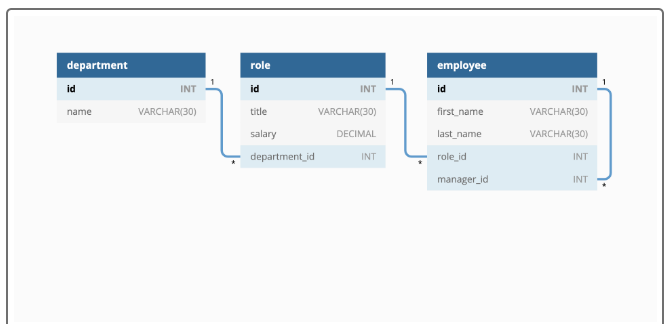
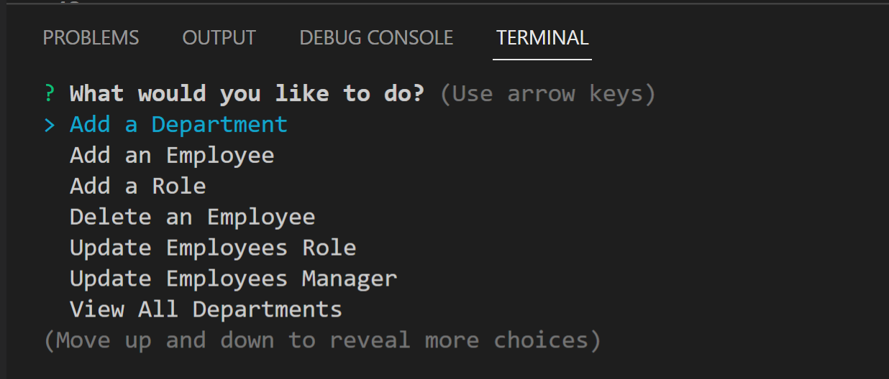
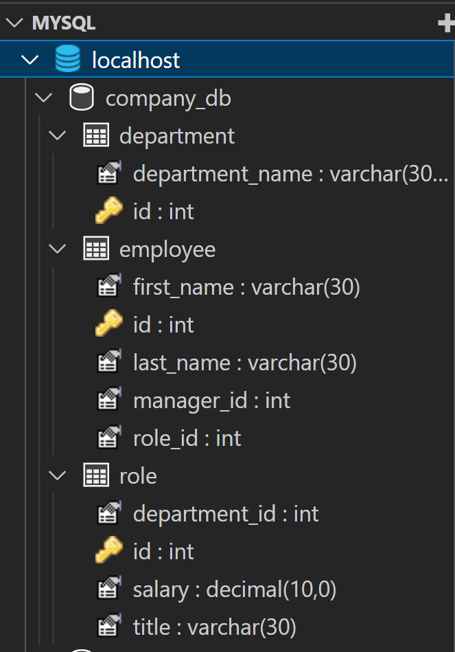

# Employee Tracker -- MySQL
### OSU Bootcamp Challenge 12
---------------------------------------------------
## Devloped By: Megan Beekman (2022), [GitHub profile --->](https://github.com/meganbeek98)
    developed using: MySQL, JavaScript, jQuery, Node.js

---------------------------------------------------

## About:  
    GIVEN a command-line application that accepts user input
    WHEN I start the application
    THEN I am presented with the following options: view all departments, view all roles, view all employees, add a department, add a role, add an employee, and update an employee role
    WHEN I choose to view all departments
    THEN I am presented with a formatted table showing department names and department ids
    WHEN I choose to view all roles
    THEN I am presented with the job title, role id, the department that role belongs to, and the salary for that role
    WHEN I choose to view all employees
    THEN I am presented with a formatted table showing employee data, including employee ids, first names, last names, job titles, departments, salaries, and managers that the employees report to
    WHEN I choose to add a department
    THEN I am prompted to enter the name of the department and that department is added to the database
    WHEN I choose to add a role
    THEN I am prompted to enter the name, salary, and department for the role and that role is added to the database
    WHEN I choose to add an employee
    THEN I am prompted to enter the employee’s first name, last name, role, and manager, and that employee is added to the database
    WHEN I choose to update an employee role
    THEN I am prompted to select an employee to update and their new role and this information is updated in the database

---------------------------------------------------

## User Story:  
    AS A business owner
    I WANT to be able to view and manage the departments, roles, and employees in my company
    SO THAT I can organize and plan my business

---------------------------------------------------

## Screenshots and Media:  

### Video Demo at link below:
## [Screencast on Google Drive](https://drive.google.com/file/d/1ak939wjKFf_v6HKiDCa3px8wrZnXkPZJ/view)

Chart from 'Mock-up' showing the design of the database schema:
</img>

</img>

</img>

## [Screencast on Google Drive](https://drive.google.com/file/d/1ak939wjKFf_v6HKiDCa3px8wrZnXkPZJ/view)

---------------------------------------------------

## How To Install and Run:  
    Install required packages:

        npm init
        npm install inquirer
        npm install mysql2
        npm install console-table
        npm install figlet
        npm install chalk
        npm install nodemon
        npm install validator

    Run:
        npm start / node index.js

---------------------------------------------------

## Links:  

## [GitHub Repository](https://github.com/meganbeek98/employee-tracker.git)

## [Screencast on Google Drive](https://drive.google.com/file/d/1ak939wjKFf_v6HKiDCa3px8wrZnXkPZJ/view)

----------------------------------------------------

## Some resources used to develop:  
    - OSU Coding Bootcamp (2022) -- modules, and the instructors & TA's
    - Slack (including 'ASKBCS' assistants)
    - Github
    - MDN Web Docs
    - stackoverflow
    - w3schools.com
    - And last, but certainly not least --> Google!

----------------------------------------------------
----------------------------------------------------
